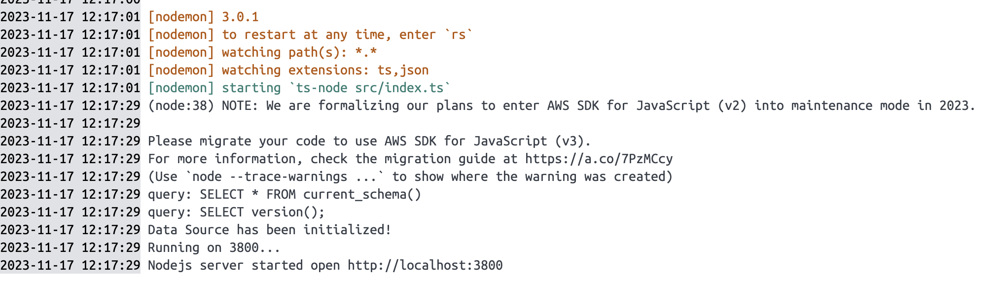
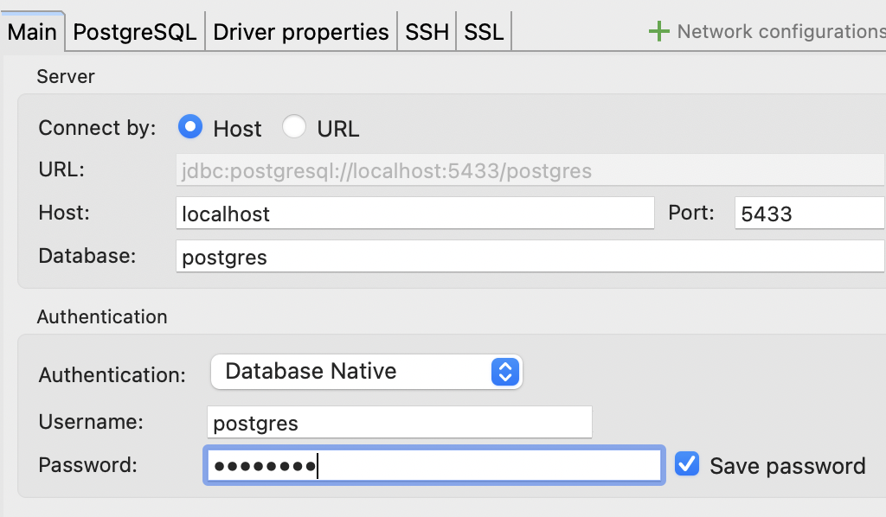
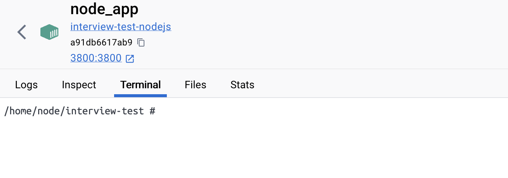
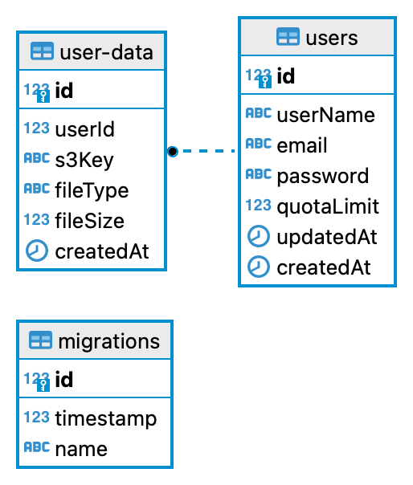
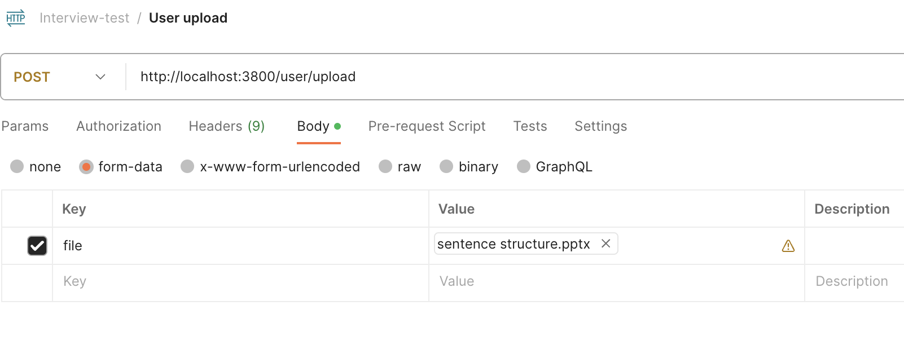
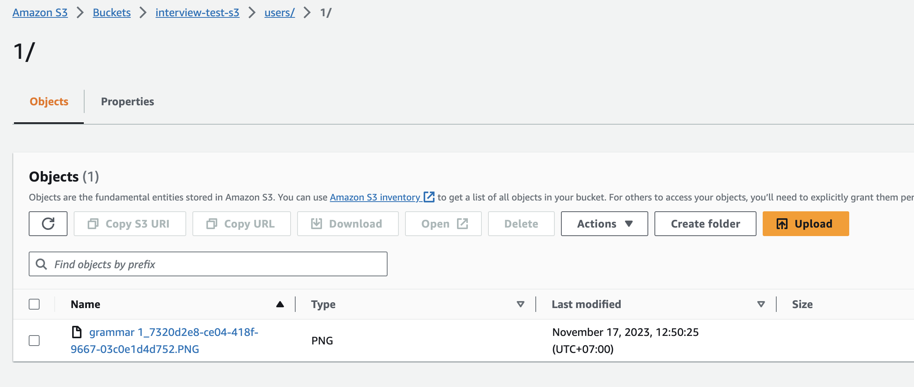

# File monitoring service

## 1. Set up

1. Clone the repository
2. Download and install:
   - [Docker](https://www.docker.com/products/docker-desktop/)
   - [Nodejs](https://nodejs.org/en/download/)
3. On the terminal, cd into the project root & run the following commands:
   - `git checkout master`
   - `npm i`

4. Please update env values for upload to S3 in .env file
```
AWS_ENV_REGION=
AWS_ENV_ACCOUNT_ID=
AWS_ENV_ACCESS_KEY_ID=
AWS_ENV_SECRET_ACCESS_KEY=
AWS_ENV_BUCKET=
```

You may overwrite any of the other `.env` variables within this file

5. After update values for .env please run the command to start docker containers:

- `make docker-start`

and then start docker and you go to the node app and check logs and if the node app shows info like this, it means everything works ok


This will start the server on http://localhost:3800

There is information to connect database

- Host: localhost
- Database: postgres
- Username: postgres
- password: postgres

6. Run migration:
- After start containers in docker, that you need to access node app shell to run migration by:

```bash
# Access into node container Shell by the cli
$ docker exec -it CONTAINER_NAME /bin/sh
```
Or you may open the terminal of the node app container by docker desktop and then access to node container shell environment and run the command below to migrate database


and then run this cli to migrate database:

```bash
# migration database
$ npm run typeorm migration:run
```


### Migration

##### Run migration

```bash
$ npm run typeorm migration:run
```

##### Revert migration
- if you want to revert and delete all user's data you can run revert by:
```bash
$ npm run typeorm migration:revert
```

### Makefile

##### Starting Containers (Node and Postgres)

```bash
$ make docker-start
```

##### Stopping Containers (Node and Postgres)

```bash
$ make docker-stop
```


## 2. Project Architecture

```yaml
.
├── src
│   ├── config                   # Contain constants for env
│   ├── database                 # Connect database and migration folders
│   ├── routes                   # Declare routes are using in app
│   ├── services                 # Common services for app
│   ├── validator                # Common validators for app
│   ├── modules
│   │   ├── users                # Module user
│   │   │    │─── controllers    # Contain class controllers
│   │   │    │─── dto            # Contain DTO files for validation
│   │   │    │─── models         # Model
│   │   │    │─── repositories   # Repository class to interact database through model
│   │   │    │─── services       # Services
│   │   ├── auth                 # Module auth for login user with jwt
│   │   │    │─── controllers    # Contain class controllers
│   │   │    │─── services       # Services
│   ├── utils                    # **Global** (utility and helper) modules
│   └── index.ts                 
```

## 3. Structure database


## 4. APIs Endpoint

There are APIs endpoint in project:
```
# Create user API
http://localhost:3800/user
```
```
# Update user quota limitation API
http://localhost:3800/user/quota
```
```
# Login user
http://localhost:3800/user/login
```
```
# Upload file
http://localhost:3800/user/upload
```
```
# Get user's files data
http://localhost:3800/user/files-data/:userId
```
```
# Get file info
http://localhost:3800/user/file/:fileId
```

## 5. How to use the service
#### Create user
- Firstly, you need to create a user's account to travel in this app
- Use the API to create user
   - URL: http://localhost:3800/user
   - Method : POST
   - Body
      ```json
      {
         "userName": string,
         "email": string,
         "password": string
      }
      ```
   - Response data
      ```json
      {
         "data": {
            "userName": string,
            "email": string,
            "password": string,
            "id": number,
            "quotaLimit": number, // quota limitation for upload ( bytes )
            "updatedAt": Date,
            "createdAt": Date
         },
         "msg": "User created success"
      }
      ```
- Import API by postman curl
   ```
   curl --location 'http://localhost:3800/user' \
   --header 'Content-Type: application/json' \
   --data-raw '{
      "userName": "",
      "email": "",
      "password": ""
   }'
   ```
#### Login user
- After the user has registered successfully, you need to sign in to get an access token and the service will give authorization to interact with the app through an access token
   - Use this api to login and get an access token
      - URL: http://localhost:3800/user/login
      - Method : POST
      - Body
         ```json
         {
            "email": string,
            "password": string
         }
         ```
      - Response data
         ```json
         {
            "data": {
               "id": number, # user id
               "userName": string,
               "email": string,
               "accessToken": string // use this access token for authenticate with some APIs
            },
            "msg": "User created success"
         }
         ```
- Import API by postman curl
   ```
   curl --location 'http://localhost:3800/user/login' \
   --header 'Content-Type: application/json' \
   --data-raw '{
      "email": "",
      "password": ""
   }'
   ```

#### Allocate quota limitation upload for each user
- Default quota limitation for each user is 10MB ( if you want change you can update QUOTA_LIMIT_UPLOAD in .env )
- Maximum file size upload in MAXIMUM_FILE_SIZE_UPLOAD ( 5MB ) in .env
- In order to change the quota limitation upload for the user and you're going to use the API to update
   - URL: http://localhost:3800/user/quota
   - Method : POST
   - Headers: Attach the access token inside Authorization
      ```
      Authorization: Bearer {{access_token}}
      ```
   - Body
      ```json
      {
         "userId": number, // Specific the user that you want to change quota limitation
         // change the number of limit ( MB )
         // Example: set 10 -> 10MB quota limit
         "quotaLimit": number 
      }
      ```
   - Response data
      ```json
      {
         "data": {},
         "msg": "Updated quota limit success"
      }
      ```
- Import API by postman curl
   ```
   curl --location --request PUT 'http://localhost:3800/user/quota' \
   --header 'Authorization: Bearer {{access_token}}
   --header 'Content-Type: application/json' \
   --data '{
      "userId": "",
      "quotaLimit": 10
   }'
   ```

#### Upload file
- In order to upload a file to S3, you will use the API below:
   - URL: http://localhost:3800/user/upload
   - Method : POST
   - Headers: Attach the access token inside Authorization
      ```
      Authorization: Bearer {{access_token}}
      ```
   - Body: form-data
      ```
      file: choose file upload
      ```
      - See the screenshot how to choose a file
      
   - Response data
      ```json
      {
         "data": {
            "userId": number, // user id
            "s3Key": string,
            "fileType": string,
            "fileSize": number,
            "id": number, //fileId
            "createdAt": Date
         },
         "msg": "User created success"
      }
      ```
- Import API by postman curl
   ```
   curl --location 'http://localhost:3800/user/upload' \
   --header 'Authorization: Bearer {{access_token}} 
   --form 'file=@""'
   ``` 
- If your upload file exceeds the quota limitation and then the the service will respond an error like this:
   ```json
   {
      "success": false,
      "message": "The upload quota has exceeded the limitation of the system. The limitation of the quota is 10.00 MB. Please choose another file."
   }
   ```

- After you have uploaded a file to S3 and then you can access the S3 service on AWS, and open the bucket you will see file structure uploaded: 


#### Get Files Data
- After you have uploaded files and if you want to view files that have been uploaded please call this API to check
   - URL: http://localhost:3800/user/files-data/:userId
   - Method : GET
   - Headers: Attach the access token inside Authorization
      ```
      Authorization: Bearer {{access_token}}
      ```
   - Response data
      ```json
      {
         "data": [
            {
                  "id": number, // file id
                  "userId": number, // user id
                  "s3Key": string, // s3 key
                  "fileType": string,
                  "fileSize": number, // file size of file uploaded ( byte )
                  "createdAt": Date
            },
            ...
         ],
         "msg": ""
      }
      ```
- Import API by postman curl
   ```
   curl --location 'http://localhost:3800/user/files-data/:userId' \
   --header 'Authorization: Bearer {{access_token}}'
   ``` 
#### Get file Info
- The API will return file information containing an S3-signed url
   - URL: http://localhost:3800/user/file/:fileId
   - Method : GET
   - Headers: Attach the access token inside Authorization
      ```
      Authorization: Bearer {{access_token}}
      ```
   - Response data
      ```json
      {
         "data": [
            {
                  "id": number, // file id
                  "userId": number, // user id
                  "s3Key": string,
                  "fileType": string,
                  "fileSize": number,
                  "createdAt": Date,
                  "s3SignUrl": string // S3 sign url
            },
            ...
         ],
         "msg": ""
      }
      ``
- Import API by postman curl
   ```
   curl --location 'http://localhost:3800/user/file/:fileId' \
   --header 'Authorization: Bearer {{access_token}}'
   ```
